# Secure Cloud Storage
This project's aim is to provide a secure cloud storage solution that ensures data privacy and integrity. We are building and securing a cloud object storage environment using tools like MinIO, Docker, and OpenSSL. The project will focus on implementing ecrypted storage, access control, and secure data transfer protocols.

---

## Phase 1: Setting Up the Environment

### System Components
- **Data Source**: A simulated dataset of 100,000 user records generated in Python and stored as a CSV file.  
- **Storage Platform**: MinIO, an open-source object storage server compatible with Amazon S3 APIs, deployed via Docker.  
- **Security Tools**: OpenSSL for TLS/SSL certificates (encryption in transit) and MinIO's IAM for Role-Based Access Control (RBAC).  
- **Logging Capability**: MinIO's native API audit trace logging to monitor security events and access requests.  

---

### System Architecture Diagram
```

                               +---------------------------------------+
                               |          CLIENT / ACCESS LAYER        |
                               |                                       |
  [ Python Script ]            |    [ Web Browser ]    [ Terminal ]    |
  (data_generator.py) -------> |      (MinIO UI)        ('mc' CLI)     |
    Generates 100k             |     Port: 9001         Port: 9000     |
    records (CSV)              +-----------+------------------+--------+
                                           |                  |
                                           v                  v
                               +---------------------------------------+
                               |     NETWORK & SECURITY ENFORCEMENT    |
                               |                                       |
                               |  TLS/HTTPS (OpenSSL Certificates)     |
                               |  IAM & RBAC (JSON Policies)           |
                               +-------------------+-------------------+
                                                   |
                                                   v
+-----------------------------------------------------------------------------------+
|  DOCKER HOST (Fedora Linux)                                                       |
|                                                                                   |
|    +-------------------------------------------------------------------------+    |
|    |  MINIO CONTAINER (quay.io/minio/minio)                                  |    |
|    |                                                                         |    |
|    |  +-------------------+  +-------------------+  +---------------------+  |    |
|    |  | S3 API Endpoint   |  |   IAM Engine      |  | Audit / Trace Log   |  |    |
|    |  | (Listens on 9000) |  | (Validates Roles) |  | (Captures 403/200)  |  |    |
|    |  +-------------------+  +-------------------+  +---------------------+  |    |
|    |                                 |                                       |    |
|    |                                 v                                       |    |
|    |  +-------------------------------------------------------------------+  |    |
|    |  |                  ENCRYPTION LAYER (SSE-S3)                        |  |    |
|    |  |            (KMS Secret Key via Environment Variables)             |  |    |
|    |  +-------------------------------------------------------------------+  |    |
|    |                                 |                                       |    |
|    |                                 v                                       |    |
|    |  +------------------------------+------------------------------------+  |    |
|    |  |  [ hr-data Bucket ]                    [ finance-data Bucket ]    |  |    |
|    +--+-------------------------------------------------------------------+--+    |
|                                      |                                            |
|                                      v                                            |
|    +---------------------------------+------------------------------------+       |
|    |                       PERSISTENT STORAGE                             |       |
|    |       Host Volumes: ./data (Objects) & ./certs (SSL Keys)            |       |
|    +----------------------------------------------------------------------+       |
+-----------------------------------------------------------------------------------+
```
---

In this first step, we will set up the environment required for our secure cloud storage solution. This includes installing Docker and Docker Compose, generating SSL/TLS certificates, and creating a `docker-compose.yml` file to spin up a standalone MinIO instance. 

1) **Generating the SSL/TLS Certificates**
```bash
mkdir -p minio-env/certs minio-env/data
cd minio-env
openssl req -x509 -nodes -days 365 -newkey rsa:2048 \
  -keyout certs/private.key \
  -out certs/public.crt \
  -subj "/CN=localhost"

```
- The above command generates a self-signed SSL/TLS certificate and a private key. The certificate is valid for 365 days and is stored in the `certs` directory.
- Why we do this: Generating SSL/TLS certificates is crucial for encrypting data in transit. It ensures that any data sent between the client and the server is secure and cannot be intercepted by malicious actors. 

2) **Creating the Docker Compose File**
```yaml
version: '3.8'

services:
  minio:
    image: quay.io/minio/minio:latest
    container_name: minio-secure
    ports:
      - "9000:9000" 
      - "9001:9001" 
    environment:
      - MINIO_ROOT_USER=admin4030
      - MINIO_ROOT_PASSWORD=SuperSecurePassword123!
    volumes:
      - ./data:/data
      - ./certs:/root/.minio/certs
    command: server /data --console-address ":9001"
    restart: unless-stopped
```
We do this because:
- Docker Compose allows us to define and manage multi-container applications. By using a `docker-compose.yml` file, we can easily set up and configure the MinIO server along with any other necessary services in a single command. This simplifies deployment and ensures that all components are correctly configured to work together.

- Certificate Mounting: The `docker-compose.yml` file will include volume mounts for the SSL/TLS certificates. This ensures that the MinIO server can access the necessary certificates for secure communication. MinIO automatically looks in ~/.minio/certs for certificates on startup. Mounting our local directory there forces MinIO to boot in HTTPS mode

- Port separation: We explicitly define port 9000 for S3 API traffic and 9001 for the Web Management Console. This allows us to apply different network monitoring or firewall rules to API vs. human traffic later.

3) **Starting the environment**

Once the `docker-compose.yml` file is created, we can start the MinIO server and any other services defined in the file using the following command:
```bash
docker-compose up -d

# check the status of the containers
docker  ps

# check the logs of the containers
docker logs minio-secure
```
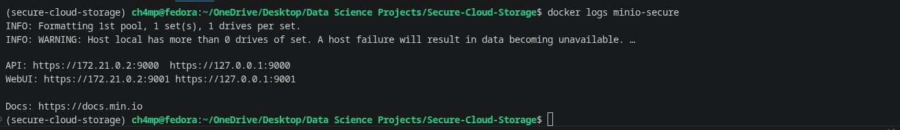
You should see output confirming MinIO is listening on https://127.0.0.1:9000 and https://127.0.0.1:9001. If it says http://, the certificates were not mounted correctly.

---

## Phase 2: Data Generation

To simulate a real-world corporate cloud storage environment, we generated a custom dataset using a Python script `data_generator.py`.  
- **Dataset Size**: The generated CSV file contains exactly 100,000 records, strictly fulfilling the minimum size requirement.  
- **Generation Tools**: The dataset was programmatically generated using Python to ensure realistic, randomized data distribution for testing access controls.
- Data Schema: The dataset represents corporate documents and consists of the following attributes tailored to our scenario:  
  - Document_ID: A unique alphanumeric identifier for each file.  
  - Author: The employee who generated the document.  
  - Department: The organizational unit assigned to the file (e.g., HR, Finance, Legal, Executive).  
  - Sensitivity_Level: The data classification tier (Public, Internal, Confidential, Strictly Confidential).  
  - File_Size_MB: The simulated file size.  
  - Upload_Date: The timestamp of when the document was added. 

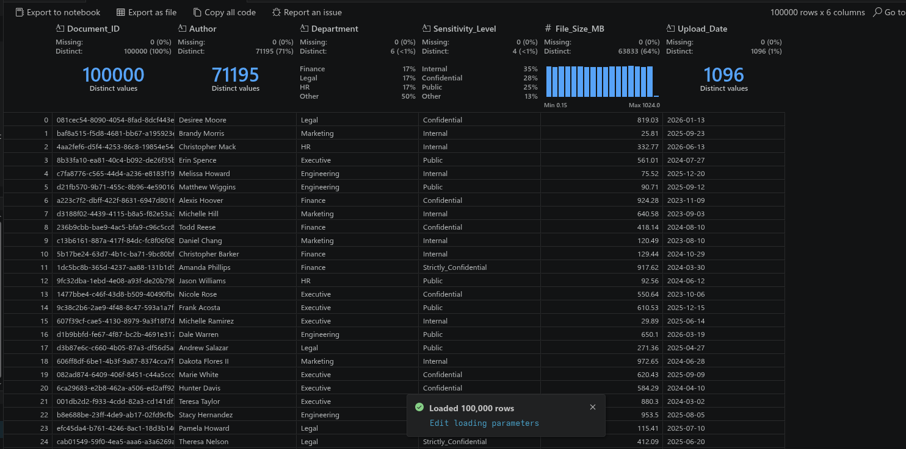


---

## Phase 3: Security Controls (RBAC & Encryption)

For this phase, we will focus on implementing security controls to ensure that our cloud storage solution is secure and compliant with best practices. This includes setting up Role-Based Access Control (RBAC) and enabling Server-Side Encryption (SSE) for our storage buckets.

1. MinIO Client (mc) Configuration

We utilize the MinIO Client to manage the server and configure security policies.
```bash
curl https://dl.min.io/client/mc/release/linux-amd64/mc \
  --create-dirs -o $HOME/minio-binaries/mc
chmod +x $HOME/minio-binaries/mc
export PATH=$PATH:$HOME/minio-binaries/

./mc alias set localminio https://127.0.0.1:9000 admin4030 SuperSecurePassword123! --insecure
```

2. Secure Storage and User Creation

We created isolated logical containers (buckets) for department data and provisioned dedicated users.
```bash
./mc mb localminio/hr-data --insecure
./mc mb localminio/finance-data --insecure

./mc admin user add localminio HR_User HRPwd123! --insecure
./mc admin user add localminio Finance_User FinPwd123! --insecure
```
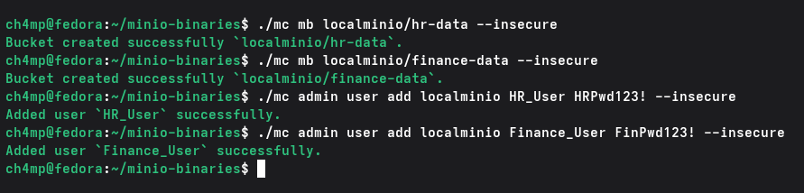

- We use the `mc` command-line tool to create buckets and manage users. The `--insecure` flag is used because we are using self-signed certificates for our MinIO server.
- A bucket is a logical container for storing objects (files) in MinIO. By creating separate buckets for different departments (HR and Finance), we can enforce access control policies and ensure that only authorized users can access the data.
- KMS (Key Management Service) is used to manage encryption keys for server-side encryption. By enabling SSE with a KMS key, we ensure that the data stored in the buckets is encrypted at rest, providing an additional layer of security.

3. Role-Based Access Control (RBAC)

We enforce the Principle of Least Privilege by restricting access based on user roles. The following policy ensures the HR user can only manage the hr-data bucket, while allowing the Web Management Console to load the root directory successfully.

- hr-policy.json
```json
{
  "Version": "2012-10-17",
  "Statement": [
    {
      "Effect": "Allow",
      "Action": ["s3:ListAllMyBuckets"],
      "Resource": ["arn:aws:s3:::*"]
    },
    {
      "Effect": "Allow",
      "Action": ["s3:GetObject", "s3:PutObject"],
      "Resource": ["arn:aws:s3:::hr-data/*"]
    },
    {
      "Effect": "Allow",
      "Action": ["s3:ListBucket"],
      "Resource": ["arn:aws:s3:::hr-data"]
    }
  ]
}
```
This JSON policy allows the HR_User to perform any action on the `hr-data` bucket and its contents. Similar policies can be created for the Finance_User to restrict access to the `finance-data` bucket. To apply these policies, we will use the `mc` command-line tool to set the policies for each user.
```bash
./minio-binaries/mc admin policy create localminio hr-access hr-policy.json --insecure
./minio-binaries/mc admin policy attach localminio hr-access --user HR_User --insecure
```
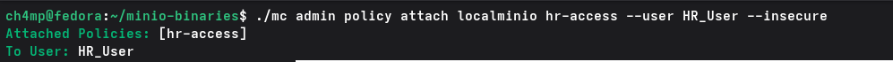

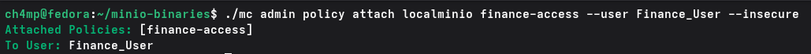

4. Server-Side Encryption (SSE)

We configured Server-Side Encryption using a Key Management Service (KMS) to ensure data is encrypted at rest.  Add the KMS secret key to `docker-compose.yml`

```yaml
environment:
      - MINIO_ROOT_USER=admin4030
      - MINIO_ROOT_PASSWORD=SuperSecurePassword123!
      - MINIO_KMS_SECRET_KEY=my-minio-key:K7MDENG/bPxRfiCYzU+z7aQxYx1EXAMPLEKEY=
```

- Restart the containers and enforce automatic SSE on the buckets:
```bash
docker-compose down
docker-compose up -d
./minio-binaries/mc encrypt set sse-s3 localminio/hr-data --insecure
./minio-binaries/mc encrypt set sse-s3 localminio/finance-data --insecure
```
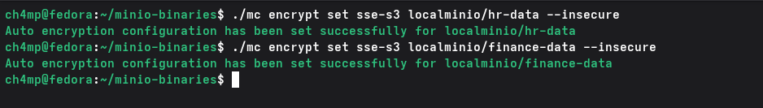

- Verify that the buckets are encrypted:
```bash
./minio-binaries/mc encrypt info localminio/hr-data --insecure
./minio-binaries/mc encrypt info localminio/finance-data --insecure
```
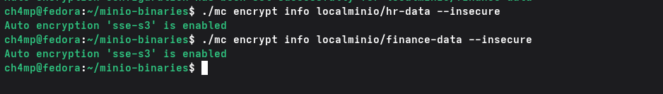
---

## Phase 4: Security Testing Matrix

This section documents six security tests validating the controls implemented in the MinIO environment.

1) Test 1: RBAC Boundary Test - Authorized Access

- **Objective**: Verify authorized users can access their respective buckets and perform allowed actions.  
- **Procedure**: Configure the client alias for HR_User and upload document_metadata.csv to the hr-data bucket.  

```bash
./minio-binaries/mc alias set hruser https://127.0.0.1:9000 HR_User HRPwd123! --insecure
./minio-binaries/mc cp document_metadata.csv hruser/hr-data/ --insecure
```
- **Expected Result**: The file upload completes successfully.  
- **Actual Result**: The upload completed successfully. 
- **Evidence**: Terminal output showing the transfer progress and completion.
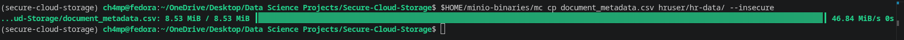

2) Test 2: RBAC Boundary Test - Unauthorized Access
- **Objective**: Verify unauthorized users cannot access buckets they lack permissions for.  
- **Procedure**: Log in as HR_User and attempt to list the contents of the finance-data bucket.  

```bash
./minio-binaries/mc ls hruser/finance-data/ --insecure
```
- **Expected Result**: The system denies access and blocks the command.  
- **Actual Result**: The system denied access. 
- **Evidence**: Terminal output stating: mc: <ERROR> Unable to list folder. Access Denied.

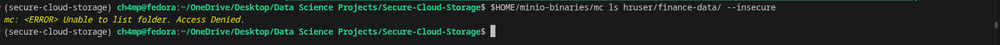

3) Test 3: Unauthorized Access Prevention Test
- **Objective**: Ensure that unauthorized users cannot access the MinIO server without valid credentials.  
- **Procedure**: Attempt to access the MinIO server using invalid credentials.  
```bash
curl -k https://127.0.0.1:9000/hr-data/
```
- **Expected Result**: Access is denied.  
- **Actual Result**: Access was denied, returning an XML error payload..  
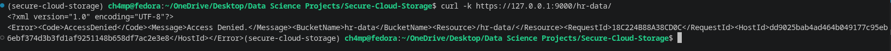

4) Test 4: In-Transit Encryption Enforcement Test
- **Objective**: Verify that all data transmitted between the client and the MinIO server is encrypted using SSL/TLS.  
- **Procedure**: Capture network traffic while performing operations on the MinIO server and analyze the captured packets to ensure that the data is encrypted.  
```bash
curl http://127.0.0.1:9000
```
- **Expected Result**: The connection is rejected, enforcing HTTPS.  
- **Actual Result**: The server rejected the plain HTTP request.  
- **Evidence**: Terminal output stating: Client sent an HTTP request to an HTTPS server.
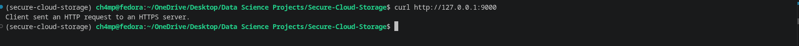


5) Test 5: Server-Side Encryption (SSE) Verification Test
- **Objective**: Ensure data stored in the buckets is encrypted at rest.  
- **Procedure**: Query the encryption configuration of the finance-data bucket.
```bash
./minio-binaries/mc encrypt info localminio/finance-data --insecure
```
- **Expected Result**: The system reports SSE is enabled.  
- **Actual Result**: The system confirmed SSE is active.
- **Evidence**: Terminal output stating: Auto encryption 'sse-s3' is enabled
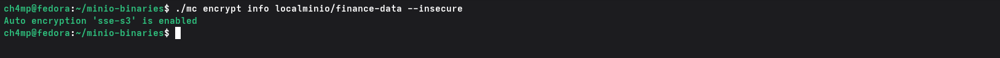

6) Test 6: Audit Log Capture and Review Test
- **Objective**: Verify access and actions performed on the server are logged for auditing.  - - **Procedure**: Start a live administrative trace in one terminal, then trigger an RBAC violation in a second terminal. 

```bash
# Terminal 1: Start the trace
./minio-binaries/mc admin trace localminio --insecure

# Terminal 2: Trigger the violation
./minio-binaries/mc ls hruser/finance-data/ --insecure
```
- **Expected Result**: The unauthorized action is immediately captured in the trace logs.
- **Actual Result**: The trace captured the 403 Forbidden event.  
- **Evidence**: Trace logs showing the request signature, IP address, and 403 HTTP status code. 
- Triggered violation
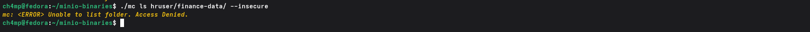

- Violation captured in the trace
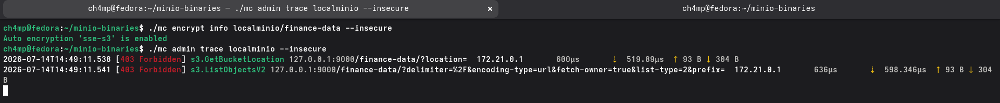

---

## Phase 5: Recommendations

In this final phase, we will document the entire project, including the setup, configuration, security controls, and testing procedures. Additionally, we will conduct a risk assessment to identify potential risks associated with the MinIO cloud storage environment and recommend controls to mitigate them.

1. Vulnerabilities Identified

- **Platform Limitations**: The MinIO Community Edition Web UI exhibits a bug where administrative menus fail to render on single-drive deployments. This forced a complete reliance on the mc CLI for policy creation and attachment.

- **Self-Signed Certificates**: Using OpenSSL to generate self-signed certificates successfully encrypts data in transit but requires the --insecure flag to bypass client-side validation. This trains users to ignore security warnings.

2. Remaining Risks

- **Single Point of Failure**: The current architecture uses Docker Compose with storage volumes bound directly to the local host. A hardware failure on the host machine will result in complete data unavailability.

- **Decentralized Identity**: IAM users and passwords are created and managed locally within the isolated MinIO instance. This approach lacks centralized oversight and increases the risk of orphaned accounts when employees leave.

- **Ephemeral Audit Logs**: The current API audit trace logging requires an active terminal session. If the container restarts or the session is terminated, historical access logs are not persistently stored.

3. Improvements for Enterprise Implementation

- **High Availability**: Replace Docker Compose with a Kubernetes cluster. Deploying MinIO in distributed mode across multiple nodes ensures fault tolerance and data redundancy.

- **Centralized Authentication**: Integrate Active Directory (AD) or an OpenID Connect (OIDC) provider. This allows for centralized identity management, single sign-on (SSO), and automated onboarding/offboarding.

- **Persistent Threat Detection**: Deploy a centralized log aggregation stack, such as Elasticsearch. Forwarding MinIO audit traces to Elasticsearch ensures logs are permanently retained, searchable, and capable of triggering automated alerts for 403 Forbidden events.

- **Trusted Infrastructure**: Replace the self-signed OpenSSL certificates with certificates issued by a trusted internal Certificate Authority (CA) to remove the need for insecure bypass flags.

---

## Risk Assessment Table

| Risk Description | Impact | Likelihood | Recommended Controls |
|---|---|---|---|
| Data Interception in Transit | High | Low | Enforce SSL/TLS certificates for secure communication between clients and the storage server[cite: 1]. |
| Unauthorized Data Access (Lateral Movement) | High | Medium | Implement Role-Based Access Control (RBAC) policies to restrict access based on departmental roles[cite: 1]. |
| Physical Data Theft / Disk Compromise | High | Low | Enable Server-Side Encryption (SSE) with a Key Management Service (KMS) to encrypt data at rest[cite: 1]. |
| Unauthenticated Public Exposure | High | High | Disable anonymous access and require valid credentials for all MinIO server requests[cite: 1]. |
| Administrative Interface Compromise | High | Medium | Separate Web Management Console traffic to a dedicated port (9001) and enforce strong credentials[cite: 1]. |

---

## Conclusion

This project successfully demonstrates the implementation of a secure cloud storage solution using MinIO, Docker, and OpenSSL. By following best practices in security, including Role-Based Access Control (RBAC), Server-Side Encryption (SSE), and secure communication protocols, we have created an environment that ensures data privacy and integrity. The risk assessment highlights potential vulnerabilities and provides recommendations for further improvements, particularly for enterprise-level deployments. Overall, this project serves as a foundational framework for building secure cloud storage solutions in real-world scenarios.
